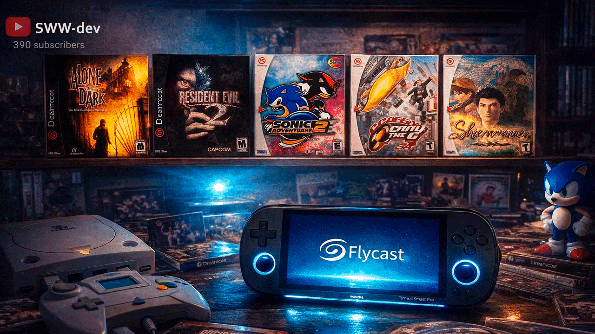
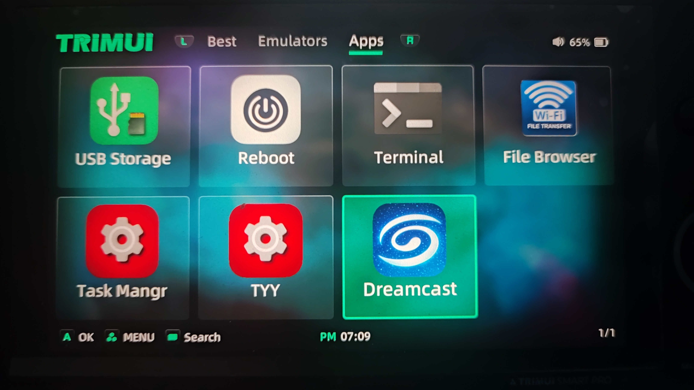
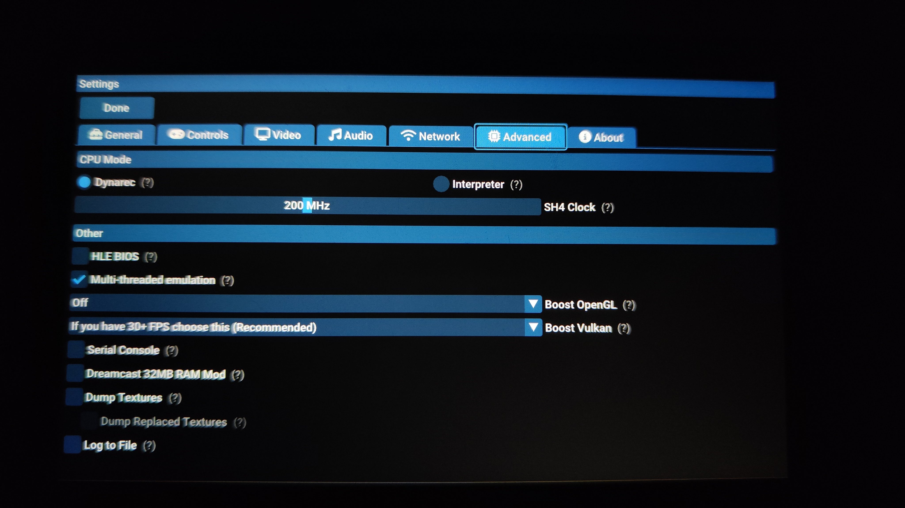

# 🎮 Flycast Standalone (Trimui Smart Pro)



Optimized **Flycast Standalone** build for **Trimui Smart Pro**, focused on better performance, cleaner launching, and optional Boost features for selected games.

---

## ✨ Features

- 🚀 Optimized launcher (no console spam before/after launch)
- 🎯 Optional Boost mode (OpenGL / Vulkan)
- 🧠 Clean framebuffer handling
- 🎮 Designed specifically for Trimui Smart Pro
- ⚠️ Safe defaults to avoid instability

---

## 📦 Installation

### 1️⃣ Copy files

- Copy **`Apps`** and **`Emus`** folders to your **SD card**
- Copy **`.local`** and **`.config`** folders to **internal storage root** (`/`)

Final directory structure:

```
/mnt/SDCARD/Apps
/mnt/SDCARD/Emus
/.local
/.config
```

After installation, the **Dreamcast** section will appear in the **Applications** menu.

---

## ⚙️ Emulator Settings

1. Open **Emulator Settings**
2. Go to the **Advanced** tab
3. Choose **only ONE** rendering option:
   - ✅ OpenGL **or**
   - ✅ Vulkan

⚠️ Do **NOT** enable both at the same time.


---

## 🚀 Boost Mode – Important Notes

- Boost mode **does not work in all games**
- ❌ **WinCE games** — Boost is **NOT recommended**
- ❌ Games with frequent drops **below 30 FPS** — Boost is **NOT recommended**
- Boost may cause visual artifacts or instability in unsupported titles

Use Boost **only when the game is stable**.

---

## ❤️ Support the Project

If you like this project and want to support development:

- ⭐ Star this repository
- 📺 Subscribe to my **YouTube channel**
👉 [Something Went Wrong](https://www.youtube.com/@sww-dev)
- 💸 Send a donation via **cryptocurrency**
👉 (USDT TRC20): TFNyZZYzk2VP99fXLMjjtpiXSHiBiucTKH

Every bit of support helps improve performance, compatibility, and future features.

---

## ⚠️ Disclaimer

This project is provided **as-is**.  
Some features are experimental and may behave differently depending on the game.

---

## 📜 License

This project follows the license of the original **Flycast** project.  
All rights belong to their respective owners.

